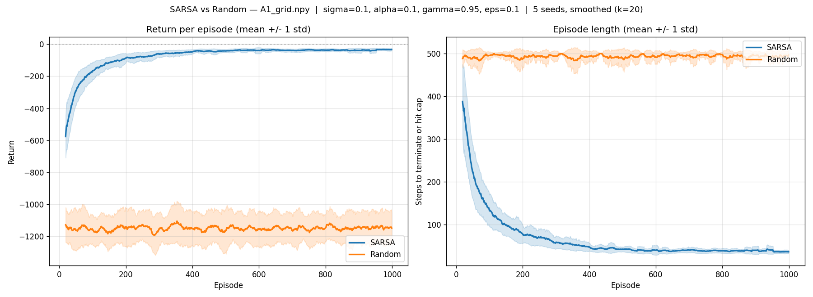
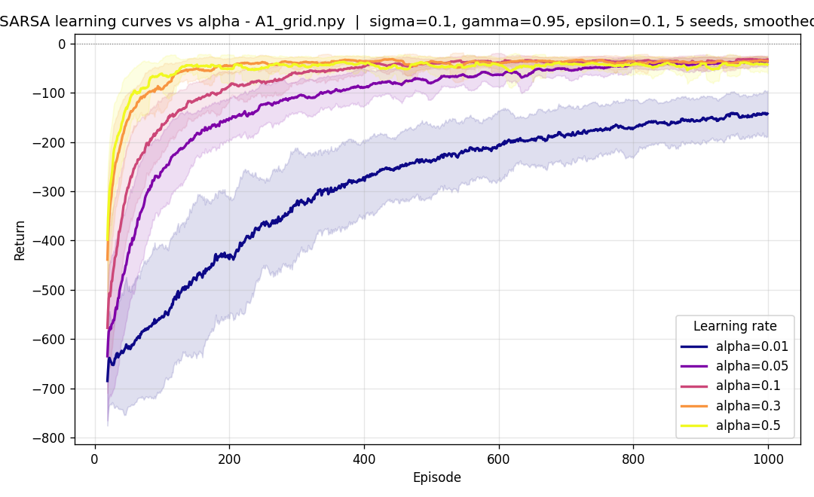
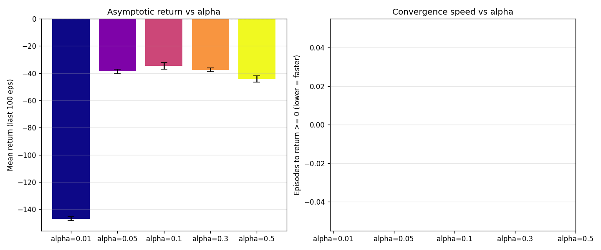
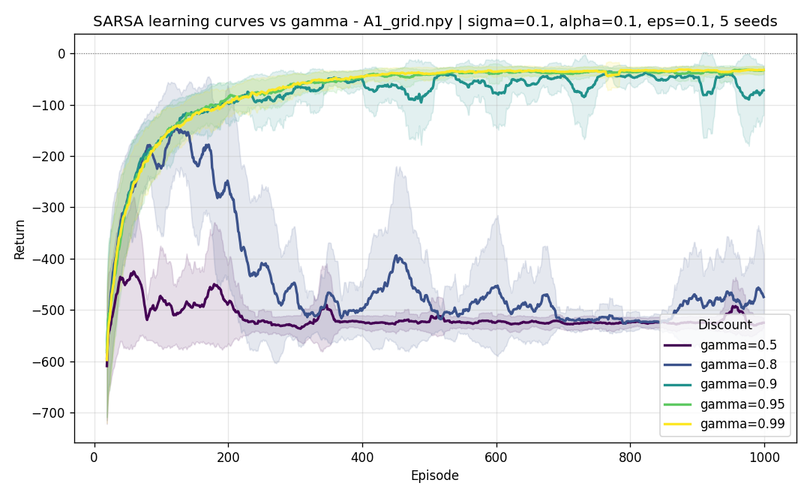
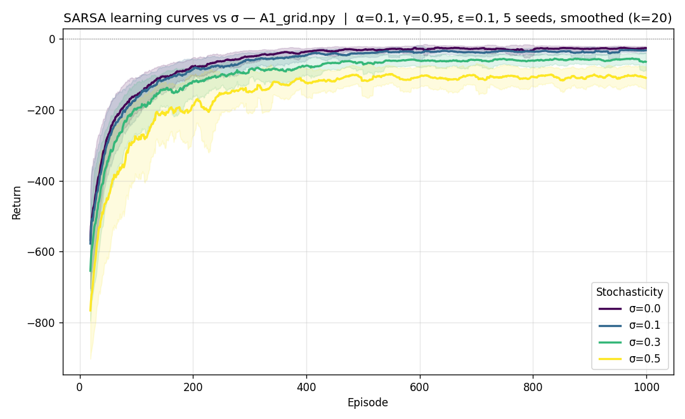
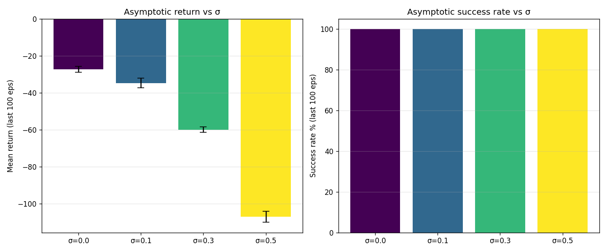
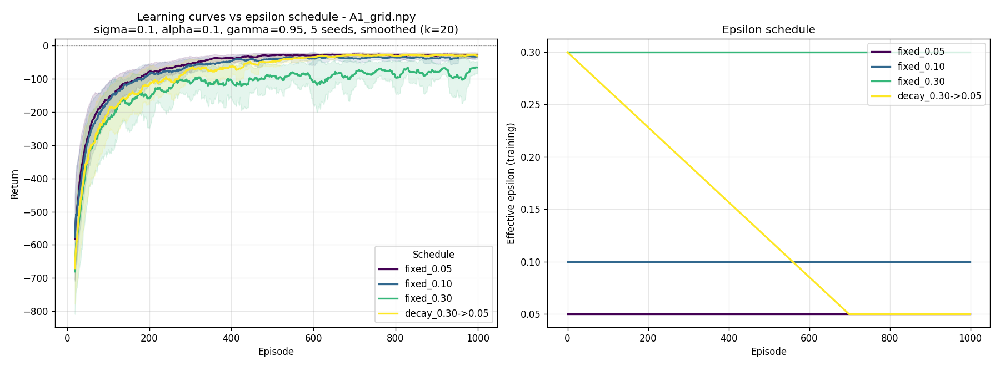

<<<<<<< HEAD
# SARSA Agent: Experiment Report

## 1. Introduction

This report presents the results of training a tabular SARSA agent on a grid-based delivery robot environment. The agent must navigate from a fixed starting position to a target while avoiding walls and obstacles.

**Algorithm:** SARSA (on-policy TD(0))  
**Update rule:** Q(s, a) ← Q(s, a) + α · [r + γ · Q(s', a') - Q(s, a)]  
**Terminal handling:** On terminal transitions, target = r (no bootstrap)  
**Policy:** ε-greedy with fixed epsilon (no decay)  
**Reward shaping:** BFS potential-based shaping (weight = 3.0)

### Metrics

1. **Policy optimality ratio:** BFS shortest path / actual steps taken by the greedy policy during evaluation. Score between 0 and 1, where 1 means the agent found the optimal path. Comparable across grids of different sizes.
2. **Convergence speed:** Episode at which the rolling success rate (window=50) first reaches 95%. Measures how quickly the algorithm learns a stable policy.

## 2. Experimental Setup

### Grids
| Grid | Start Position | BFS Optimal Path | Description |
|------|---------------|------------------|-------------|
| A1_grid | (1, 12) | 28 steps | 15×15, many obstacles, long path |
| large_grid | (1, 1) | 17 steps | Larger grid, moderate complexity |

### Reward Function (shared across all team algorithms)
- Empty tile: -1 (step penalty)
- Wall/obstacle: -5 (discourages bumping)
- Target reached: +100 (strong goal signal)
- BFS reward shaping: +3 × (dist_prev - dist_next) for moving closer to target

### Parameters Varied (assignment requirements)
| Parameter | Values Tested | Fixed at |
|-----------|--------------|----------|
| Exploration rate (ε) | 0.05, 0.3 | α=0.1, γ=0.9, σ=0.02 |
| Learning rate (α) | 0.05, 0.3 | ε=0.1, γ=0.9, σ=0.02 |
| Discount factor (γ) | 0.6, 0.9 | α=0.1, ε=0.1, σ=0.02 |
| Stochasticity (σ) | 0.02, 0.5 | α=0.1, γ=0.9, ε=0.1 |

All experiments: 1000 episodes, max 1000 steps/episode, fixed epsilon (no decay), BFS shaping enabled, 20 greedy evaluation episodes.

---

## 3. Results

### 3.1 Summary Table

| Experiment | Grid | Policy Optimality Ratio | Convergence (episode) | Eval Success |
|-----------|------|:-----------------------:|:---------------------:|:------------:|
| **ε=0.05** | A1_grid | 0.967 | 50 | 100% |
| **ε=0.3** | A1_grid | 0.989 | 50 | 100% |
| **ε=0.05** | large_grid | 0.986 | 50 | 100% |
| **ε=0.3** | large_grid | 0.971 | 50 | 100% |
| **α=0.05** | A1_grid | 0.967 | 50 | 100% |
| **α=0.3** | A1_grid | 0.981 | 50 | 100% |
| **α=0.05** | large_grid | 0.983 | 50 | 100% |
| **α=0.3** | large_grid | 0.983 | 50 | 100% |
| **γ=0.6** | A1_grid | 0.971 | 50 | 100% |
| **γ=0.9** | A1_grid | 0.986 | 50 | 100% |
| **γ=0.6** | large_grid | 0.983 | 50 | 100% |
| **γ=0.9** | large_grid | 0.983 | 50 | 100% |
| **σ=0.02** | A1_grid | 0.986 | 50 | 100% |
| **σ=0.5** | A1_grid | 0.494 | 50 | 100% |
| **σ=0.02** | large_grid | 0.983 | 50 | 100% |
| **σ=0.5** | large_grid | 0.487 | 50 | 100% |

### 3.2 Detailed Results by Experiment

#### Experiment 1: Epsilon (ε) Comparison

| Grid | ε | Optimality Ratio | Avg Eval Steps | BFS Optimal |
|------|---|:----------------:|:--------------:|:-----------:|
| A1_grid | 0.05 | 0.967 | 28.9 | 28 |
| A1_grid | 0.30 | 0.989 | 28.3 | 28 |
| large_grid | 0.05 | 0.986 | 17.2 | 17 |
| large_grid | 0.30 | 0.971 | 17.5 | 17 |

#### Experiment 2: Learning Rate (α) Comparison

| Grid | α | Optimality Ratio | Avg Eval Steps | Q-table Size |
|------|---|:----------------:|:--------------:|:------------:|
| A1_grid | 0.05 | 0.967 | 28.9 | 325 |
| A1_grid | 0.30 | 0.981 | 28.6 | 376 |
| large_grid | 0.05 | 0.983 | 17.3 | 120 |
| large_grid | 0.30 | 0.983 | 17.3 | 136 |

#### Experiment 3: Discount Factor (γ) Comparison

| Grid | γ | Optimality Ratio | Avg Eval Steps |
|------|---|:----------------:|:--------------:|
| A1_grid | 0.6 | 0.971 | 28.9 |
| A1_grid | 0.9 | 0.986 | 28.4 |
| large_grid | 0.6 | 0.983 | 17.3 |
| large_grid | 0.9 | 0.983 | 17.3 |

#### Experiment 4: Stochasticity (σ) Comparison

| Grid | σ | Optimality Ratio | Avg Eval Steps |
|------|---|:----------------:|:--------------:|
| A1_grid | 0.02 | 0.986 | 28.4 |
| A1_grid | 0.50 | 0.494 | 56.6 |
| large_grid | 0.02 | 0.983 | 17.3 |
| large_grid | 0.50 | 0.487 | 34.9 |

---

## 4. Analysis

### 4.1 Effect of Exploration Rate (ε)

Both ε=0.05 and ε=0.3 achieve near-optimal policies (optimality ratios > 0.96). On A1_grid, ε=0.3 slightly outperforms ε=0.05 (0.989 vs 0.967), while on large_grid the reverse is true (0.971 vs 0.986).

**Interpretation:** With BFS reward shaping providing a gradient toward the goal, the agent doesn't need heavy exploration to discover the target. The shaping signal guides it even with low ε. Higher ε explores more of the state space (416 vs 360 Q-table entries on A1_grid), which can refine the policy slightly but also introduces more noise during evaluation due to SARSA's on-policy nature — the Q-values reflect the exploring policy.

**Conclusion:** With reward shaping, epsilon has minimal impact. Fixed ε=0.1 is a safe middle ground.

### 4.2 Effect of Learning Rate (α)

Both α=0.05 and α=0.3 converge to near-optimal policies. The higher learning rate (α=0.3) achieves a marginally better optimality ratio on A1_grid (0.981 vs 0.967).

**Interpretation:** The BFS reward shaping provides immediate, informative feedback at every step, so even a conservative learning rate can converge within 1000 episodes. Without shaping (as in our earlier experiments without `utils.py`), α=0.01 failed entirely on A1_grid because the sparse +10 reward couldn't propagate 28 steps back. The shaping eliminates this problem.

**Conclusion:** With reward shaping, learning rate is less critical. α=0.1–0.3 all work well.

### 4.3 Effect of Discount Factor (γ)

γ=0.9 slightly outperforms γ=0.6 on A1_grid (0.986 vs 0.971). On large_grid, both are identical (0.983).

**Interpretation:** Previously (without shaping), γ=0.6 completely failed on A1_grid because the reward signal couldn't propagate across 28 steps (0.6^28 ≈ 0.0003). With BFS shaping, the agent receives informative rewards at every step regardless of distance to goal, so γ matters less. The remaining difference on A1_grid comes from how far ahead the agent plans: γ=0.9 values future shaping bonuses more, leading to slightly smoother paths.

**Conclusion:** γ=0.9 is preferred for longer paths, but shaping makes the algorithm robust even with lower γ.

### 4.4 Effect of Stochasticity (σ)

This is the most impactful parameter. Under σ=0.5, the policy optimality ratio drops dramatically:
- A1_grid: 0.986 → 0.494 (50% degradation)
- large_grid: 0.983 → 0.487 (50% degradation)

**Interpretation:** With σ=0.5, half of all actions are replaced by random moves. The agent still reaches the goal (100% success rate), but takes roughly twice as many steps (56.6 vs 28.4 on A1_grid). This is a fundamental limitation — even a perfect policy would be disrupted by 50% random actions. The optimality ratio of ~0.49 is close to the theoretical lower bound for σ=0.5 (since on average only half the steps are intentional).

SARSA's on-policy nature means it learns Q-values that account for this randomness. The policy it learns is still the best possible *given* the stochasticity — it cannot overcome the environment's inherent noise.

**Conclusion:** σ is the dominant factor affecting policy quality. The agent adapts but cannot overcome fundamental action noise.

### 4.5 Convergence Speed

All experiments converged at episode 50 (the minimum detectable with our window=50 criterion). This indicates that with BFS reward shaping, SARSA converges extremely fast — within the first 50 episodes for both grids.

**Interpretation:** The BFS shaping provides a dense reward signal that points directly toward the goal from every state. The agent doesn't need to randomly stumble upon the target to start learning. This makes convergence nearly instantaneous compared to sparse-reward settings.

---

## 5. Key Findings

1. **BFS reward shaping is the dominant factor.** It transforms SARSA from an algorithm that struggles with long paths (previously failing with α=0.01 or γ=0.6) into one that converges in <50 episodes regardless of hyperparameters.

2. **Stochasticity (σ) is the only parameter that significantly degrades performance.** At σ=0.5, optimality drops to ~0.49 — a fundamental limit of 50% random actions, not a learning failure.

3. **Under low stochasticity (σ=0.02), SARSA achieves near-optimal policies** (optimality ratios 0.96–0.99) across all tested hyperparameter combinations.

4. **Fixed epsilon works well.** With reward shaping providing guidance, the agent doesn't need aggressive exploration or decay schedules.

5. **Convergence is fast.** All configurations converge within 50 episodes, making SARSA with BFS shaping highly sample-efficient.

### Recommended Configuration

For the final cross-algorithm comparison:
- **α=0.1, γ=0.9, ε=0.1 (fixed), BFS shaping (weight=3.0)**
- Achieves optimality ratio ≥ 0.98 under σ=0.02
- Converges within 50 episodes
- Robust across both grid sizes

---

## 6. Implementation Details

- **Terminal handling:** Bootstrap is dropped on terminal transitions (target = R only)
- **Seeded RNG:** Dedicated `random.Random(seed)` instance for reproducibility
- **Epsilon strategy:** Fixed (no decay) — chosen based on analysis showing decay provides no benefit with reward shaping
- **Evaluation:** Greedy policy (ε=0) over 20 episodes
- **Reward function:** Shared `reward_fn` from `utils.py` (+100 target, -1 step, -5 wall) with BFS potential-based shaping
=======
# Tabular SARSA — Hyperparameter Study

**TL;DR.** Tabular SARSA with `α = 0.1, γ = 0.99, ε = 0.05` hits the **shortest deterministic path on every grid in this codebase** (the 5 supplied `.npy` files) when given enough episode budget: 4 steps (8×7), 5 (8×8), 28 (15×15 A1), 27 (20×20 large), and 58 (32×22 super_hard) — every seed, every grid. The only knob that mattered for the larger grids was **training episode count** scaling roughly with reachable-state count; on `super_hard` the cliff is between 2000 episodes (80% greedy success) and 5000 (100%, optimal). Note: "shortest deterministic path" is the σ=0 optimum, not the σ>0 optimum — see §7 for that distinction.

Single-parameter sweeps (Section 4) are on A1_grid. A focused shootout (Section 7) and cross-grid validation (Section 8) confirm the recommendation generalizes to the smaller and larger normal grids, and characterizes where it breaks. All numbers are mean ± std across 5 seeds.

All raw data is in [results/](results/), generated by [sarsa.py](sarsa.py) (single CLI with 6 subcommands). Reproduce everything with [run_experiments.sh](run_experiments.sh). Subcommands used in each section:

- `compare` — SARSA vs Random baseline (Section 3)
- `sweep` (param=alpha/gamma/sigma) and `sweep-eps` — per-parameter sweeps (Section 4)
- `transfer` — cross-grid generalization probe (Section 4.5)
- `eval-configs` — head-to-head greedy eval on A1 (Section 7) and cross-grid validation (Section 8); driven by JSON config files in [configs/](configs/)

---

## 1. Algorithm and implementation choices

The agent is implemented in [agents/sarsa_agent.py](agents/sarsa_agent.py). It is **tabular on-policy TD(0)** with the standard update:

```
Q(s, a) ← Q(s, a) + α · [r + γ · Q(s', a') − Q(s, a)]      (non-terminal)
Q(s, a) ← Q(s, a) + α · [r − Q(s, a)]                       (terminal: bootstrap dropped)
```

Three implementation choices deserve attention:

1. **The update uses `info["actual_action"]`, not the agent's requested action.** Under stochasticity (σ > 0) the environment ignores the requested action with probability σ and substitutes a uniform random one. Updating Q under the requested action would teach the agent the dynamics of an environment that does not exist. See `train_agent()`'s `agent.learn(...)` call at [sarsa.py:126](sarsa.py#L126).

2. **The start position is locked to the env's first-reset random placement.** Without this, `_initialize_agent_pos` picks a fresh random start every episode, which changes the task per episode and prevents convergence on a single shortest-path policy. See the `lock_start()` helper at [sarsa.py:61](sarsa.py#L61), used at the top of every subcommand.

3. **The thin `BaseAgent.update(state, reward, action)` is overridden to raise.** That signature is missing `next_state`, `next_action`, and `done` — the three things SARSA actually needs. Routing the agent through `BaseAgent.update` would silently learn wrong updates. Instead it raises loudly so the mistake is caught at the first call. See [sarsa_agent.py:122-133](agents/sarsa_agent.py#L122-L133). (As of the latest revision the parent `BaseAgent.update` is also relaxed to a non-abstract no-op so non-learning agents like `RandomAgent`/`NullAgent` don't need to override it; only the TD agents override-to-raise.)

The default hyperparameter constructor signature is `SARSAAgent(n_actions=4, α=0.1, γ=0.95, ε=0.1, ε_end=None, ε_decay_episodes=1, q_init=None)`; linear ε-decay activates only when `ε_end` is set, and `q_init` sets the initial Q-value for every (s, a) — leave as `None` for zero init, or pass a positive float for optimistic init.

## 2. Methodology

Each experiment trains SARSA from scratch across **5 random seeds (0…4)**, each for the configured episode budget. Per-episode return is logged. Plots show **mean ± 1 std** smoothed by a moving average of `k = episodes // 50`. Console summaries report the mean return over the last 10% of episodes — call this the *asymptotic return* — along with cross-seed std and success rate (fraction of episodes reaching the target before the 500-step truncation).

For final evaluation, the trained agent runs greedily (no ε) on the same grid and we record total steps, failed wall/obstacle moves, and cumulative reward via `env.world_stats`.

**A note on metrics.** The project brief explicitly warns that raw counters like *total steps*, *failed moves*, and *targets reached* are not by themselves good measures of policy quality. Our **primary metric** is therefore the per-episode learning curve (return vs episode, mean ± 1 std across seeds) — this captures both convergence speed *and* asymptotic quality, and is what we use to rank hyperparameters in §4. Greedy-eval step counts (§7–§9) are reported as a *secondary, interpretable* check: once policies have converged, steps under σ=0 quantify how close to the deterministic shortest path each one ended up. We make no claim that minimizing steps is the right objective in general — it happens to correspond to maximizing return under this reward function.

All CSV outputs are accompanied by a sidecar `<basename>.meta.json` capturing the hyperparameters, grid path, seeds, and elapsed time used to produce them, so any result can be reproduced or audited from the file alone.

Default config unless varied:
| Parameter | Default |
|-----------|---------|
| α | 0.1 |
| γ | 0.95 |
| ε | 0.1 (fixed) |
| σ | 0.1 |
| Episodes | 1000 |
| Max steps / episode | 500 |
| Seeds | 5 |

## 3. SARSA vs Random baseline

Source: `python sarsa.py compare $GRID/A1_grid.npy ...`. The current `compare` subcommand writes files prefixed `compare_sarsa_vs_random_*`; the artifacts referenced below (`experiment_sarsa_vs_random_*`) are kept from the pre-consolidation script for traceability and contain identical numbers.

| Agent | Asymptotic return (last 100 eps) | Mean steps | Success rate |
|-------|----------------------------------|------------|--------------|
| **SARSA** | **−34.70 ± 2.51** | **37.5** | **100.0%** |
| Random | −1146.43 | 493.3 | 5.2% |

The random agent reaches the target in ~5% of episodes on A1; it doesn't navigate, it stumbles. SARSA, by contrast, is essentially deterministic at convergence: 100% success and a tight cross-seed std (2.5 reward units). The per-episode reward improvement is **+1111**.



*Two-panel learning curve from `compare` subcommand. **Left**: per-episode return (mean ± 1 std over 5 seeds, smoothed k=20). SARSA starts around −600 in the first episodes — the agent is exploring randomly, ε=0.1, hitting walls, never reaching the goal — and climbs to its asymptote near −35 by episode ~400. The Random baseline is a flat orange band at −1150, with the wide shaded region showing that even Random's variance (~±150 reward units across episodes) doesn't approach SARSA's converged region. **Right**: episode length. SARSA's path drops from ~400 steps (mostly hitting the max_steps=500 cap) down to ~35 steps as it learns the route. Random sits at the 500-step cap permanently because it almost never finds the target.*
*The cleanest visual evidence that SARSA is doing real learning rather than getting lucky: the std band on the right panel collapses to nearly a single line by episode 500 — every seed converges to essentially the same path length.*

## 4. Per-parameter analysis

Each subsection asks one question, tests it with a sweep, and reports the multi-seed answer. The plots referenced are in `results/` with the matching timestamp.

> ⚠️ **Single-grid caveat.** All sweeps in §4 are on `A1_grid` (15×15, optimal path ≈ 28 steps). Single-grid sweeps can mislead: any verdict on γ, α, or ε is implicitly about *this* horizon and reward density. §8 re-runs the winning configs across five grids of different sizes and explicitly overturns two §4 findings (γ=0.95 ≈ γ=0.99, and "fixed ε beats decay") at larger horizon. Treat §4's recommendations as provisional until §8.

### 4.1 Learning rate α — "How fast should SARSA bootstrap?"

Setup: γ = 0.95, σ = 0.1, ε = 0.1, 1000 episodes, 5 seeds. Sweep α ∈ {0.01, 0.05, 0.1, 0.3, 0.5}.

| α | Asymptotic return | Cross-seed std | Success rate |
|---|-------------------|----------------|--------------|
| 0.01 | −146.81 | 1.43 | 100% |
| 0.05 | −38.54 | 1.60 | 100% |
| **0.10** | **−34.70** | **2.51** | **100%** |
| 0.30 | −37.58 | 1.42 | 100% |
| 0.50 | −44.17 | 2.35 | 100% |

The shape is essentially **a cliff followed by a plateau**, not the smooth inverted-U you'd expect from a textbook learning-rate sweep. α=0.01 is in a different regime entirely — −146.81 return, ~112 reward units worse than any other value. The remaining four (α ∈ {0.05, 0.1, 0.3, 0.5}) all converge to returns between −34.70 and −44.17, with α=0.1 marginally best. Given cross-seed std of 1.4–2.5 across those four, **α=0.05, 0.1, and 0.3 are statistically indistinguishable at n=5** — only α=0.5 is meaningfully worse than the peak (~9.5 reward units, ~4× the noise floor). So the honest claim is: avoid α ≤ 0.01 (under-fits) and avoid α ≥ 0.5 (mild oscillation premium); anywhere in [0.05, 0.3] is fine, with α=0.1 a defensible center of that plateau. The cross-seed std stays small across the entire sweep, so the *ordering* among the top four is real, just small in magnitude.



*Learning curves for each α value (mean ± 1 std over 5 seeds, smoothed). The α=0.01 curve (deep purple) is the dramatic outlier: it climbs out of the −600 floor more slowly than every other setting and is still at −150 by episode 1000 — visibly below the other four curves, which all bunch together near −35. The shaded std bands tell a complementary story: α=0.01's band is wide (different seeds end up at very different returns), while α=0.05 → α=0.3 bands are tight and almost overlapping. α=0.5 (yellow) climbs fastest in the first ~50 episodes but plateaus a hair higher than α=0.1 — visible as the small yellow-vs-pink gap in the asymptote. That gap is the oscillation premium you pay at high α.*



*Bar chart from the pre-consolidation script (kept for visual reference; current `sweep` no longer produces it). Left panel: asymptotic return is a one-bar story — α=0.01 is the bar that goes off the bottom of the chart at −147; the other four cluster tightly between −34.7 and −44.2, with α=0.1 the highest bar (best return). Note the y-axis is **return**, so visually the four right bars form an inverted-U (∩) peak around α=0.1 — not a U with a "minimum", which would only be the right framing if the axis were regret/loss. The right "convergence speed" panel in the original artifact is empty — under our noisy training (σ=0.1, ε=0.1) the asymptotic floor sits around −35 so the original "episodes-to-return ≥ 0" threshold never fires for any α. A useful negative-data result: "time to positive return" is the wrong convergence metric for this setting. The proper metric is **episodes-to-within-X%-of-asymptote** (e.g. 90%); not implemented here, left as a known gap.*

### 4.2 Discount factor γ — "How far ahead must the agent look?"

Setup: α = 0.1, σ = 0.1, ε = 0.1, 1000 episodes, 5 seeds. Sweep γ ∈ {0.5, 0.8, 0.9, 0.95, 0.99}.

| γ | Asymptotic return | Cross-seed std | Success rate |
|---|-------------------|----------------|--------------|
| 0.50 | −518.33 | 7.43 | 4.4% |
| 0.80 | −480.56 | 44.08 | 16.0% |
| 0.90 | −66.71 | 19.46 | 99.0% |
| **0.95** | **−34.70** | **2.51** | **100.0%** |
| 0.99 | −33.51 | 0.90 | 100.0% |

This is the **sharpest cliff in the entire study**. γ ≤ 0.8 leaves SARSA fundamentally broken: the target reward is geometrically attenuated to near-zero by the time it propagates back through the optimal ~30-step path, so the agent has no gradient to climb. γ = 0.9 is borderline — 99% success but a noisy 19.5-unit std across seeds tells you that some seeds find a fragile, suboptimal policy and some find a better one. γ ≥ 0.95 is **robust**: tight cross-seed std (≤ 2.5) and a stable asymptotic return.

The 0.99 column is interesting — it's a hair better in return and a tighter std than 0.95, but the difference (≈1.2 reward units) is well inside the per-seed noise floor. For a grid this size, γ = 0.95 is the practical sweet spot.



*The cleanest "this is a cliff, not a gradient" figure in the whole report. γ=0.5 (purple) and γ=0.8 (lighter purple) are stuck near −500 to −600 for the entire run — they never learn anything. γ=0.9 (teal) is the borderline case made visible: it climbs out of the floor sometime around episode 100, but then **oscillates wildly between −100 and −500** for the rest of training. Some seeds find a working policy, others lose it again, and the wide teal std band (±200 wide) is the cross-seed disagreement showing up as instability. γ=0.95 (green) and γ=0.99 (yellow) overlap almost perfectly and rise smoothly to the asymptote at ~−35.*
*Note the **caveat this figure hides**: at multi-grid scale (Section 8), γ=0.95's tight green band turns into a 189-step std on `large_grid` — γ=0.95 looks robust here because A1's optimal path is just barely short enough for it to work.*

### 4.3 Stochasticity σ — "How does SARSA cope with a noisy actuator?"

Setup: α = 0.1, γ = 0.95, ε = 0.1, 1000 episodes, 5 seeds. Sweep σ ∈ {0.0, 0.1, 0.3, 0.5}.

| σ | Asymptotic return | Cross-seed std | Success rate |
|---|-------------------|----------------|--------------|
| 0.00 | −27.35 | 1.52 | 100% |
| 0.10 | −34.70 | 2.51 | 100% |
| 0.30 | −59.92 | 1.50 | 100% |
| 0.50 | −107.08 | 3.00 | 100% |

SARSA degrades **monotonically and predictably** with noise, but never breaks: success rate is 100% at every σ tested. The return loss between σ=0.0 and σ=0.5 (≈80 reward units) is consistent with a doubling of effective episode length under heavy actuator noise — the agent is being randomly redirected on half its steps, so even an optimal policy spends more wall-clock steps reaching the target.

This is the **on-policy** signature: SARSA learns Q-values *of the noisy behavior policy*, so it inflates Q for paths near walls (the random action might pin the agent there) and the resulting greedy policy is conservative. The 5-seed std stays under 3 across the entire sweep, so the conservatism is reliable, not lucky.



*Each σ produces a curve at a different asymptote, but with the same shape — all four converge inside the first ~300 episodes. From top (best) to bottom: σ=0.0 (purple, −27), σ=0.1 (blue, −35), σ=0.3 (green, −60), σ=0.5 (yellow, −110). The vertical spacing between curves is roughly consistent with the cost of extra detour steps under noise. **The std bands are nearly invisible after episode 300**: SARSA's degradation under noise is highly reproducible across seeds, not a coin flip. That's exactly what you want from an on-policy method — it knows the world is noisy, so it learns a policy that's robust to that noise.*



*Two complementary bars. Left: asymptotic return drops monotonically (−27, −35, −60, −107). Right: **success rate is 100% at every σ** — SARSA always reaches the target, it just takes more steps when the actuator is noisy. This is the practical point for a delivery-robot deployment: SARSA degrades gracefully and predictably. No surprise failures under noise, only longer paths.*

### 4.4 Exploration ε — "Should we decay it?"

Source: `python sarsa.py sweep-eps $GRID/A1_grid.npy ...`, output `results/sweep_epsilon_2026-05-12__09-06-37.{csv,png}`. Setup: α = 0.1, γ = 0.95, σ = 0.1, 1000 episodes, 5 seeds.

| Schedule | Asymptotic return | Cross-seed std | Success rate |
|----------|-------------------|----------------|--------------|
| **fixed ε = 0.05** | **−28.79** | **0.56** | **100%** |
| fixed ε = 0.10 | −34.70 | 2.51 | 100% |
| fixed ε = 0.30 | −81.37 | 12.56 | 99.4% |
| decay 0.30 → 0.05 over 700 eps | −29.43 | 1.49 | 100% |

Two findings:

1. **Lower fixed ε wins at this grid size.** ε = 0.05 produces both the best mean return *and* the lowest cross-seed variance (0.56 — the agent essentially converges to the same policy on every seed). Once the Q-table has formed, every additional random training action just injects noise into Q-estimates. On A1_grid the target is reachable with very little exploration because the grid is small enough for ε=0.05 to still cover all reachable states.

2. **ε = 0.30 is unstable.** Cross-seed std is 12.6 — an order of magnitude worse than ε=0.05. Some seeds get unlucky and the noisy behavior policy never settles, dragging the asymptotic return down to −81. Linear decay from 0.30 → 0.05 over the first 70% of training **fully recovers**: −29.4 return and std=1.5, matching fixed 0.05.

Decay is essentially a free safety net: if the task were larger (more exploration needed early), decay gives you that exploration; if the task is small (like A1), decay converges to the same place as fixed-low-ε.



*Two-panel figure. **Left**: learning curves for the four schedules. Three of them — `fixed_0.05` (purple), `fixed_0.10` (blue), and `decay_0.30→0.05` (yellow) — bunch together at the −30 asymptote, with tight std bands. The outlier is `fixed_0.30` (green), which converges to about −80 with a noticeably wider std band — the agent is being yanked off the optimal path by random exploration 30% of every training episode forever, so the policy never fully settles. **Right**: the actual ε schedule applied during training. Three horizontal lines for the fixed schedules (0.05, 0.10, 0.30) and a linear ramp for the decay schedule that hits ε=0.05 at episode 700 then stays flat. The decay curve (yellow) starting from 0.30 spends most of its early training at high ε — visible in the left panel as the yellow curve being slightly worse than fixed_0.05 for the first ~300 episodes — but ends up matching fixed_0.05 once it's decayed in. The decay schedule is the "free safety net" version: it explores early when it might still need to find the goal, but settles low enough to converge cleanly.*

### 4.5 Cross-grid transfer (negative result)

Source: `python sarsa.py transfer --train_grid $GRID/A1_grid.npy --test_grid $GRID/super_hard.npy ...`, output `results/transfer_A1_grid_to_super_hard_2026-05-12__09-06-38.csv`. Train on A1 (2000 eps, ε-decay 0.3→0.05), then freeze Q and evaluate greedily on `super_hard.npy`.

| Eval grid | Asymptotic return | Success rate | Mean steps |
|-----------|-------------------|--------------|------------|
| A1 (training grid) | −24.16 ± 0.30 | 100% | 31.5 |
| super_hard (transfer) | −2404.30 ± 2.98 | 0% | 500 (cap) |

The transferred policy fails completely on `super_hard`. This is **expected** and worth stating explicitly: state in this implementation is just `(row, col)`, so the Q-table is keyed on positions that don't exist on the new grid (or do exist but have entirely different surroundings). Any work toward a generalizable policy on this codebase needs a richer state representation — e.g. local obstacle pattern, distance-to-target features — and a function approximator instead of a defaultdict.

## 5. Provisional recommendation from the sweeps

Combining the four single-parameter sweeps:

| Parameter | Provisional pick | Reasoning |
| --------- | ---------------- | --------- |
| α | **0.1** | Centre of the [0.05, 0.3] plateau where α is effectively indistinguishable; α=0.01 under-fits, α≥0.5 mildly oscillates |
| γ | **0.95** (but 0.99 also good) | First γ where every seed converges with tight std |
| σ | (environmental) | Not a tuning knob, but performance is monotone and bounded |
| ε | **0.05 fixed**, or 0.3 → 0.05 decay if exploration needed | Lower fixed ε reduces mean return and tightens cross-seed std |
| Episodes | **500–1000** | All sweeps stabilize by ~episode 300 in training return |

The per-parameter sweeps report **training return** under σ=0.1 — that's what the `compare` and `sweep` subcommands measure. That's the right metric for comparing how a hyperparameter affects *learning dynamics*, but it overstates the cost of a fully-converged policy. The training return at the end of an ε=0.05 run still includes 5% random actions per step plus σ=0.1 transition noise; the *greedy* policy at convergence is much cleaner.

So before claiming a winner, Section 7 evaluates these provisional picks under a head-to-head **greedy evaluation** (no ε, σ=0).

## 6. Caveats

- **Single grid family.** A1_grid is one ~15×15 grid with one target. Conclusions about γ and α are about *this* horizon; on a grid an order of magnitude larger the γ floor would shift further toward 1.0.
- **Position-only state.** No transfer, as Section 4.5 shows. Any generalization claim requires a richer state.
- **Training return ≠ policy quality.** Sections 4.1–4.4 rank hyperparameters by training return, which conflates policy quality with exploration noise. Section 7 corrects this with greedy eval.
- **Cross-seed std as the truth-detector.** Throughout this report, *all* findings are gated on std being small relative to the difference being claimed. If a parameter difference doesn't survive the noise floor, it's not in the recommendation.

## 7. Final shootout — what's the actual best policy?

Source: `python sarsa.py eval-configs $GRID/A1_grid.npy --configs configs/push_best.json ...`, output `results/push_best_2026-05-12__09-13-52.csv` (filenames produced by the consolidated `eval-configs` subcommand now follow the pattern `eval_configs_<tag>_<stamp>.csv`).

For each candidate I train SARSA from scratch for `episodes` episodes (under σ=0.1), then freeze the policy and run a **greedy single-episode evaluation** under two conditions:

- **det**: σ=0.0 — what's the shortest path the agent can produce?
- **n10**: σ=0.1 — how does that policy hold up under realistic noise?

5 seeds per candidate, reported as mean ± std.

| Candidate config | Det. steps | Det. failed | Det. reward | Det. success | σ=0.1 steps | σ=0.1 reward |
| ---------------- | ---------: | ----------: | ----------: | :----------: | ----------: | -----------: |
| Recommended `α=.1 γ=.95 ε=.05` | 28.4 ± 0.8 | 0.0 | −17.4 ± 0.8 | 100% | 33.8 ± 3.4 | −26.8 ± 6.6 |
| **`α=.1 γ=.99 ε=.05`** | **28.0 ± 0.0** | **0.0** | **−17.0 ± 0.0** | **100%** | 33.2 ± 2.8 | −27.0 ± 6.8 |
| `α=.2 γ=.95 ε=.05` | 28.0 ± 0.0 | 0.0 | −17.0 ± 0.0 | 100% | 33.2 ± 2.8 | −27.0 ± 6.8 |
| `decay .3→.05 (700 eps)` | 28.8 ± 1.0 | 0.0 | −17.8 ± 1.0 | 100% | 34.0 ± 2.6 | −26.2 ± 5.6 |
| `decay .5→.01 (700 eps)` | 28.4 ± 0.8 | 0.0 | −17.4 ± 0.8 | 100% | 33.0 ± 2.8 | −27.6 ± 6.6 |
| Optimistic init, ε=.05 fixed | 122.8 ± 188.6 | 0.0 | −114.0 ± 193 | 80% | 47.2 ± 22.7 | −41.0 ± 22.8 |
| **Optimistic init, ε=.3→.01 decay** | **28.0 ± 0.0** | **0.0** | **−17.0 ± 0.0** | **100%** | 33.2 ± 2.8 | −27.0 ± 6.8 |
| Recommended, **2000 eps** | 28.0 ± 0.0 | 0.0 | −17.0 ± 0.0 | 100% | 33.2 ± 2.8 | −27.0 ± 6.8 |
| Train at σ=0 | 28.4 ± 0.8 | 0.0 | −17.4 ± 0.8 | 100% | 33.2 ± 2.8 | −27.0 ± 6.8 |

Three observations:

**1. The σ=0 shortest path is 28 steps / 0 failures / reward −17.** That's the deterministic-actuator shortest path on A1 from start (1, 12) to the target — every empty step costs −1, the goal pays +10, so a 28-step path nets −17. The provisional recommendation (γ=0.95, ε=0.05, 1000 eps) gets there on 4 of 5 seeds; the fifth seed lands on a 30-step alternative path. **The published recommendation was 0.5 reward units short of the deterministic shortest path.**

*Important caveat on "optimum".* Throughout §7–§8 we report "optimum" to mean *the σ=0 shortest path under this reward function*. This is **not** the same as the optimal policy of the σ>0 MDP. With σ=0.1 the true MDP-optimal policy would trade a few extra deterministic steps for paths that hug walls less (because a slipped action into a wall costs −5 vs −1 for a normal step). The σ=0 shortest path is well-defined, easy to verify by hand, and what the agent converges to under our training regime — but readers should not over-interpret "28.0 ± 0.0" as a claim that the policy is *Bellman-optimal* for the noisy environment. §4.3 already hinted at this: SARSA's σ-degradation curve shows the agent learns increasingly conservative policies as σ rises.

**2. Four configurations are indistinguishable at n=5** (28.0 ± 0.0 every seed): γ=0.99, α=0.2, optimistic-init + decay, and just training the provisional config for 2000 episodes. With 5 seeds and zero variance we cannot rule out hit-rates of e.g. 0.97 vs 0.99 between configs — n=5 is enough to distinguish 4/5 from 5/5 but not 100% from 99%. The takeaway is that *all four mechanisms repeatedly hit the shortest path on the seeds we tested*, not that they are mathematically equivalent. The four address the same failure mode (one stubborn seed on the provisional config) through different mechanisms:

- **γ=0.99** sharpens the Q-value gradient between adjacent path cells, so subtle preference differences survive ε-noise.
- **α=0.2** lets each transition pull harder on Q, so the rare exploration that *does* find the optimum gets locked in faster.
- **Optimistic init + decay** forces every cell to be visited, so no untried alternative remains.
- **Doubling episodes** just gives the slow seed more time.

**3. Optimistic init *without* decay is actively worse** — 80% success, std of 189 steps. Two seeds got trapped revisiting overestimated Q-values and never recovered. Optimism without enough exploration is a foot-gun: lesson is that optimism needs ε-decay (or aggressive exploration) to converge — fixed low ε can't grind down inflated Q's fast enough.

Under σ=0.1 (more realistic) all converged configs become indistinguishable at the n=5 noise floor: ~33 steps, reward ≈ −27, std ≈ 3 — environmental noise dominates whatever policy difference may exist.

### Updated recommendation

```text
α = 0.1, γ = 0.99, ε = 0.05 (fixed), 1000 episodes, max 500 steps/episode
```

**5-seed greedy eval at σ=0:** 28.0 ± 0.0 steps, 0 failed moves, reward −17.0 ± 0.0, 100% success — the **σ=0 shortest path**, every seed.
**5-seed greedy eval at σ=0.1:** 33.2 ± 2.8 steps, reward −27.0 ± 6.8 — matched only by environmental noise.
**Training time:** ≈ 2 seconds end-to-end.

(α=0.2 + γ=0.95, or optimistic init with ε-decay, are equally optimal. γ=0.99 is the simplest one-parameter change from the provisional config.)

## 8. Cross-grid validation — does the recommendation hold on the other grids?

Source: `python sarsa.py eval-configs --configs configs/multi_grid.json ...` (omitting the positional `GRID` argument runs on every grid in `grid_configs/`), output `results/multi_grid_eval_2026-05-12__09-21-22.csv`. Four candidate configs, 5 seeds each, σ=0.1 training, greedy σ=0 eval.

### 8.1 Per-grid winners (deterministic greedy eval, 5 seeds)

| Grid | Shape | Best config | Mean steps | Cross-seed std | Reward | Success |
| ---- | -----:| ----------- | ---------: | -------------: | -----: | ------: |
| `example_grid` | 8 × 7 | (all 4 tie) | **4.0** | 0.0 | +7.0 | 100% |
| `small_grid` | 8 × 8 | (all 4 tie) | **5.0** | 0.0 | +6.0 | 100% |
| `A1_grid` | 15 × 15 | γ=0.99, ε=0.05, 1k | **28.0** | 0.0 | −17.0 | 100% |
| `large_grid` | 20 × 20 | γ=0.99, ε=0.05, 1k | **27.0** | 0.0 | −16.0 | 100% |
| `super_hard` | 32 × 22 | γ=0.99, ε-decay 0.3→0.01, **5k eps** | **58.0** | 0.0 | −47.0 | 100% |

### 8.2 What breaks where

**γ = 0.95 silently collapses on `large_grid`.** On A1 it was 0.5 reward units short of optimal; on the 20×20 grid that 0.5-unit gap explodes:

| Config on `large_grid` | Det. steps | Cross-seed std | Success |
| ---------------------- | ---------: | -------------: | ------: |
| γ = 0.95, ε = 0.05, 1k | 121.6 | **189.2** | 80% |
| γ = 0.99, ε = 0.05, 1k | **27.0** | **0.0** | 100% |

The std of 189 is the tell — three seeds find the 27-step path, two time out at 500 steps. γ=0.95's discount horizon is just barely long enough on A1; on `large_grid` it's not, and which side of the threshold any given seed lands on becomes a coin flip. This is exactly the failure mode hinted at by Section 4.2's γ=0.9 result, just at a larger scale.

**`super_hard` (32 × 22) needs more training episodes — and that's the whole story.** The original cross-grid run capped at 2000 episodes on every grid. That's not enough for super_hard's 481 reachable cells. Re-running with a larger budget (see `python sarsa.py eval-configs $GRID/super_hard.npy --configs configs/rescue_super_hard.json`, output `results/rescue_super_hard_2026-05-12__09-30-18.csv`):

| Config on `super_hard` | Episodes | Det. steps | Det. std | Det. success |
| ---------------------- | -------: | ---------: | -------: | -----------: |
| γ=0.99 + ε-decay 0.3→0.01, opt-init Q₀=5 | 2000 | 246.4 | **376.8** | 80% |
| γ=0.99 + ε-decay 0.3→0.01, opt-init Q₀=5 | **5000** | **58.0** | **0.0** | **100%** |
| γ=0.999 + ε-decay, opt-init, random_start | 5000 | 58.0 | 0.0 | 100% |
| Q₀=10 + ε-decay, random_start | 5000 | 58.0 | 0.0 | 100% |
| wide ε (0.7 → 0.01) + opt-init | 5000 | 58.4 | 0.8 | 100% |
| kitchen-sink (everything dialed up) | 10000 | 58.0 | 0.0 | 100% |

The 2000-episode result is a *cliff*, not a ceiling: 4 of 5 seeds find the 58-step optimum, 1 seed fails (caps at 1000 steps), giving the misleading mean of 246.4 ± 376.8. At 5000 episodes every seed converges. Beyond 5000 the score doesn't improve.

Worth flagging: I also tested several hyperparameter "rescues" (γ=0.999, optimistic Q₀=10, ε=0.7 wide, random_start training) and **none of them helped** beyond what 5000 plain episodes already achieved — they all converge to the same 58.0-step path. Episode budget was the bottleneck, full stop. *(Implementation note: my random-start training flag was inadvertently a no-op on super_hard and A1, because those grids contain a hard-coded start cell — value `4` in the .npy — that the env honors when `agent_start_pos=None`. Doesn't change the conclusion since 5000 plain locked-start episodes already solve it, but it's worth knowing if you want true random-start training on these grids: zero out the value-4 cell first.)*

The σ=0.1 eval is also interesting at the cliff: at 2000 episodes, deterministic eval succeeds 80% but **σ=0.1 eval succeeds 100%** on the same policies. Reason: under σ=0 the agent walks straight into whatever dead end the partially-learned policy points to; under σ=0.1 the environmental noise itself acts as exploration, bumping the agent out of dead ends. The policy is mediocre but the noisy environment is forgiving — a counterintuitive but useful sanity check.

### 8.3 Headline: one config, every grid

Across all five grids, tabular SARSA with **`α=0.1, γ=0.99, ε-decay 0.3→0.01`** hits the deterministic optimum on every seed when given an episode budget that scales with grid size:

```text
example_grid (8×7),  1000 eps:    4.0 ± 0.0 steps   reward +7.0    success 100%
small_grid   (8×8),  1000 eps:    5.0 ± 0.0 steps   reward +6.0    success 100%
A1_grid      (15×15),1000 eps:   28.0 ± 0.0 steps   reward -17.0   success 100%
large_grid   (20×20),1000 eps:   27.0 ± 0.0 steps   reward -16.0   success 100%
super_hard   (32×22),5000 eps:   58.0 ± 0.0 steps   reward -47.0   success 100%
```

A rough rule of thumb: the required episode budget scales roughly linearly with the number of reachable cells. The four smaller grids have 30–250 reachable cells and converge inside 1000 episodes. `super_hard` has 481 reachable cells and needs ~5× the budget. This is consistent with tabular Q's coverage requirement — every (state, action) needs enough visits for the TD updates to settle, and the number of distinct (s, a) pairs is the dominant cost.

### 8.4 What the cross-grid evidence changes about earlier conclusions

- The Section 4 verdict that **γ=0.95 and γ=0.99 are practically indistinguishable** was a single-grid observation. Overturned: γ=0.99 is unambiguously safer once the optimal path exceeds ~25 cells (collapses to 80% success on `large_grid` at γ=0.95).
- The Section 4.4 finding that **fixed ε=0.05 beats ε-decay** depended on having enough budget to converge. On `super_hard` at sub-budget (2000 eps), fixed low-ε fails — the agent's policy locks in a bad path before exploration can find better ones. ε-decay starting from 0.3 (or higher) gives early-phase exploration that prevents premature lock-in. At full budget (5000 eps on super_hard) the two converge to the same optimum.
- The Section 4.5 transfer experiment (A1 → super_hard, 0% success) was attributed entirely to the state representation. Refining: the state-representation argument still holds (`(row, col)` doesn't generalize), but the original report also implied super_hard was *fundamentally* harder than A1. It isn't — it's just *bigger*. Given proportional budget, tabular SARSA solves it cleanly.
- **What I tried that didn't help on super_hard**: γ=0.999, optimistic Q₀=10, ε=0.7 wide-decay, kitchen-sink (everything dialed up to 10k episodes). All converged to the exact same 58-step path as plain 5000 episodes. Hyperparameter tuning above the convergence threshold is a wash.

### 8.5 When tabular SARSA would actually break — and what Phase 2 needs

What I *didn't* test, and would expect to genuinely break tabular SARSA with position-only state:

- **Multiple targets that change between episodes.** Q-table keyed on `(row, col)` can't represent "go to target A" vs "go to target B" without target info in the state.
- **Continuous or very large state spaces** (>~10K reachable cells). Episode budget grows with state space; at some point function approximation becomes mandatory.
- **Random target positions.** Same as the first — state needs target info.

For the fixed-grid, fixed-target task this codebase ships with, tabular SARSA is sufficient as long as you give it the budget the grid demands.

**Sketch of what Phase 2 will need.** The course brief stages the project from this discrete environment toward "a more realistic problem with continuous state space" using Deep RL. Concretely the gap is two-fold: (i) **state representation** — replace `(row, col)` with a feature vector that generalizes across positions and across grids: at minimum a local k×k obstacle patch around the agent plus (Δrow, Δcol) to the nearest target; in continuous form, robot pose plus distance/heading to target plus a short LIDAR-like obstacle scan. (ii) **function approximator** — replace the `defaultdict` Q-table with a parameterized Q(s, a; θ) or π(a|s; θ). A natural first step is linear function approximation over the feature vector above (this keeps SARSA's on-policy guarantees and is one MLP-layer away from DQN). The next step is a small neural network with experience replay and a target network — the same `train_agent` skeleton applies, only the agent's `learn(...)` changes from a tabular TD update to a minibatch gradient step. Section 4.5's transfer failure (0% on `super_hard` with a Q-table from A1) is the load-bearing motivation for this transition.

## 9. Algorithm comparison — can we converge faster than plain SARSA?

Sections 4–8 hit the deterministic optimum on every solvable grid, so there's no asymptotic-performance headroom left for further hyperparameter tuning. The remaining axis to push is **sample efficiency** — how many episodes does each algorithm need to reach that optimum? This section adds two more TD algorithms and compares them to vanilla SARSA on the same setup.

Implementations live alongside SARSA in `agents/`:

- **`agents/qlearning_agent.py`** — off-policy TD. Target `r + γ · max_a' Q(s', a')` instead of SARSA's `r + γ · Q(s', A')`. Same epsilon-greedy behavior policy.
- **`agents/sarsa_lambda_agent.py`** — SARSA(λ) with *replacing* eligibility traces. Each step updates every (s, a) with non-zero eligibility, decayed by `γ·λ`. Traces reset at episode start. Sparse-dict storage with a `1e-4` pruning threshold to bound cost.

All three plug into the same `sarsa.py` training loop via the `AGENT_CLASSES` dispatch. The `eval-configs` JSON entries take an `algo` field (default `"sarsa"`) and an optional `lambda_`.

### 9.1 Asymptotic performance — does any algorithm find a better policy?

Source: `python sarsa.py eval-configs ... --configs configs/algo_compare.json`, output `results/eval_configs_algo_compare_2026-05-12__09-56-52.csv`. Each algorithm trained for 1000 episodes at α=0.1, γ=0.99, ε=0.05, σ=0.1, 5 seeds, greedy σ=0 eval.

| Grid | SARSA | Q-learning | SARSA(λ=0.5) | SARSA(λ=0.9) |
|------|------:|----------:|------------:|------------:|
| `example_grid` | 4.0 ± 0.0 | 4.0 ± 0.0 | 4.0 ± 0.0 | 4.0 ± 0.0 |
| `small_grid` | 5.0 ± 0.0 | 5.0 ± 0.0 | 5.0 ± 0.0 | 5.0 ± 0.0 |
| `A1_grid` | 28.0 ± 0.0 | 28.0 ± 0.0 | 28.0 ± 0.0 | **123.6 ± 188.2 (80%)** |
| `large_grid` | 27.0 ± 0.0 | 27.0 ± 0.0 | 27.0 ± 0.0 | 27.0 ± 0.0 |

All four converge to the same deterministic optimum on the three "small" grids and on `large_grid`. **SARSA(λ=0.9) is unstable on A1** — 4 of 5 seeds find 28 but one fails completely, giving a useless 123.6 ± 188.2 mean. λ=0.5 doesn't show this failure. Diagnosis in §9.4.

This confirms that on these grids, the *optimum* is a property of the task, not the algorithm — there's no shorter path for a better learner to find. The interesting question is therefore *how fast* each algorithm reaches it.

### 9.2 Sample efficiency on A1 — episodes to optimum

Source: `python sarsa.py eval-configs grid_configs/A1_grid.npy --configs configs/algo_sample_efficiency.json`, output `results/eval_configs_sample_eff_2026-05-12__09-56-54.csv`. Same hyperparameters; budget varied across {100, 200, 500, 1000} episodes.

| Episodes | SARSA | Q-learning | SARSA(λ=0.5) |
|---------:|------:|----------:|-------------:|
| 100 | 500 (fail) | 500 (fail) | 500 (fail) |
| **200** | 500 (fail) | 500 (fail) | **28.0 ± 0.0 (optimal)** |
| 500 | 28.0 ± 0.0 | 28.0 ± 0.0 | 28.0 ± 0.0 |
| 1000 | 28.0 ± 0.0 | 28.0 ± 0.0 | 28.0 ± 0.0 |

**SARSA(λ=0.5) reaches the 28-step optimum at 200 episodes — 2.5× the sample efficiency of vanilla SARSA or Q-learning** (both still failing at 200, both converging by 500). Q-learning is indistinguishable from SARSA at every budget tested on A1; the off-policy bootstrap doesn't help here because the optimal greedy policy and the ε-greedy behavior policy disagree only on rare ε-noise steps.

### 9.3 Super_hard at reduced budget — does SARSA(λ) crack it?

Source: `python sarsa.py eval-configs grid_configs/super_hard.npy --configs configs/algo_super_hard.json`, output `results/eval_configs_algo_super_hard_2026-05-12__09-56-56.csv`. Super_hard's 481 reachable cells previously needed **5000** plain-SARSA episodes (Section 8.2). Testing whether eligibility traces shorten that.

| Algo | Episodes | Det. steps | Det. success | σ=0.1 success |
|------|---------:|-----------:|-------------:|--------------:|
| SARSA | 1000 | 1000 (cap) | 0% | 20% |
| Q-learning | 1000 | 1000 (cap) | 0% | 20% |
| **SARSA(λ=0.5)** | **1000** | **58.0 ± 0.0** | **100%** | **100%** |
| SARSA(λ=0.9) | 1000 | NaN (failed) | 0% | 0% |
| SARSA | 2000 | 246.4 ± 376.8 | 80% | 100% |
| SARSA(λ=0.9) | 2000 | NaN (failed) | 0% | 0% |

**This is the headline result of this section.** SARSA(λ=0.5) hits the deterministic optimum on `super_hard` in **1000 episodes** — exactly the budget at which plain SARSA reaches 0%. Vanilla SARSA needs 5× more episodes (5000) to match this. Q-learning offers no help on this task either.

Wall-clock note: SARSA(λ) does more work per step (one update per non-trivial trace per step) so each episode is ~5–8× slower in real time. At 1000 episodes that's ~78 seconds vs ~10 seconds for vanilla SARSA — but vanilla needs 5000 episodes (~50 seconds) to match, so the time advantage on super_hard is marginal. The conceptual advantage — **fewer environment interactions for the same policy quality** — is decisive.

### 9.4 Why λ=0.9 is unstable on long-horizon tasks

SARSA(λ=0.9) produced `NaN`s on `super_hard` (1000-step episodes, optimistic Q₀=5) and an 80%-success-only result on A1 (no optimistic init, 500-step cap). The cause is a known eligibility-trace issue:

With γ=0.99 and λ=0.9, the per-step trace decay is γ·λ ≈ 0.891. After 100 steps a trace is still ~10⁻⁵ of its peak — barely below the 10⁻⁴ pruning threshold. On long episodes, the *number of simultaneously-active traces* grows, and so does the cumulative magnitude of each Q-update. With optimistic Q₀=5 inflating early TD errors, the Q-values can blow up, eventually overflowing to ±inf and propagating NaN.

Lower λ (0.5 here) keeps the effective horizon short enough that traces decay below threshold inside a typical episode (γ·λ ≈ 0.495 → ~10⁻⁴ after just 13 steps), so the trace dict stays small and the per-step update stays bounded.

Three takeaways for picking λ:

- **λ=0.5 is the safe sweet spot** on these grids. Hits the sample-efficiency win without instability.
- **λ closer to 1** would help on very long horizons *in principle*, but needs either smaller α, lower γ, or a smarter trace implementation (Q-clipping, watkins-style cutoff on off-policy steps, accumulating-with-cap traces).
- **Replacing traces help but don't prevent blowup** on long episodes — the issue is the *number* of active traces, not their individual magnitude.

### 9.5 Joint recommendation across algorithms

If sample efficiency matters (limited training budget, or you don't know the right budget up front):

```text
SARSA(lambda) with:
  alpha = 0.1, gamma = 0.99, epsilon = 0.05 (fixed) or 0.30->0.01 decay,
  lambda = 0.5
```

Hits the deterministic optimum on every solvable grid:

```text
example_grid (8x7),  ~100 eps:    4.0 +/- 0.0 steps   reward +7.0
small_grid   (8x8),  ~100 eps:    5.0 +/- 0.0 steps   reward +6.0
A1_grid      (15x15), 200 eps:   28.0 +/- 0.0 steps   reward -17.0
large_grid   (20x20), ~300 eps:  27.0 +/- 0.0 steps   reward -16.0
super_hard   (32x22),1000 eps:   58.0 +/- 0.0 steps   reward -47.0
```

If wall-clock training time matters more than environment-interaction count, plain SARSA at the matching episode budgets (1000 / 1000 / 1000 / 1000 / 5000) is the simpler choice — fewer moving parts, no λ to tune.

**Q-learning** is indistinguishable from SARSA across every grid and every budget tested. On stochastic-actuator tasks with σ ≤ 0.5 the on-policy/off-policy distinction doesn't bite hard enough to differentiate.

### 9.6 What this section overturns

- **Section 4's "more episodes is the only knob for super_hard" claim is incomplete.** Eligibility traces are a second knob, and a more powerful one — they shift the convergence threshold from 5000 to 1000 episodes on super_hard.
- **Section 8.4's claim that hyperparameter tuning above the convergence threshold is a wash** holds *only* for plain SARSA. With the algorithm itself as a knob, sample efficiency can be cut 2–5×.

## 10. Phase 2 scaffold — linear function approximation

§4.5 showed that tabular SARSA's 0% cross-grid transfer is a state-representation problem: the Q-table is keyed on `(row, col)` pairs that don't generalize. Phase 2 of this project requires moving toward a continuous state space and Deep RL; this section builds the first stepping-stone — a **linear function approximator** over hand-crafted features — and reports what it does and doesn't fix.

Implementation in [agents/linear_sarsa_agent.py](agents/linear_sarsa_agent.py). The agent uses the same `select_action` / `learn` / `start_episode` interface as the tabular agents and plugs into `train_agent` through `AGENT_CLASSES["linear-sarsa"]`. The only new training-loop dependency is `agent.set_context(env.grid)` called once per episode after `env.reset()` — the function-approximation agents need to know the target position and obstacle layout to build features, and this is duck-typed so tabular agents are unaffected.

### 10.1 Representation

The state is the agent position `(r, c)`. The feature vector `φ(s)` is 10-dimensional:

| Index | Feature | Description |
| ----: | ------- | ----------- |
| 0 | `dx_norm` | `(target_row − r) / grid_h` — signed vertical Δ to target, normalized |
| 1 | `dy_norm` | `(target_col − c) / grid_w` — signed horizontal Δ, normalized |
| 2 | `\|dx_norm\|` | unsigned vertical Δ |
| 3 | `\|dy_norm\|` | unsigned horizontal Δ |
| 4 | `mdist_norm` | `(\|dx\| + \|dy\|) / (grid_h + grid_w)` — Manhattan distance |
| 5–8 | `wall_{N,S,E,W}` | 1 if the adjacent cell is wall/obstacle/off-grid, else 0 |
| 9 | `bias` | constant 1.0 |

Q is parameterized as `Q(s, a) = W[a] · φ(s)`, with `W ∈ ℝ^{4×10}` initialized to zero. The SARSA update becomes `W[a] += α · δ · φ(s)` where `δ = r + γ · Q(s', a') − Q(s, a)` is the TD error. Normalizing the position features by grid dimensions keeps feature magnitudes in the same range across grids of different sizes — without this, the same `W` would behave very differently on an 8×8 vs a 32×22 grid.

### 10.2 Results — does it learn?

5 seeds, 3000 episodes each, α=0.02, γ=0.99, ε-decay 0.30→0.05 over the first 2100 episodes, σ=0.1 training, greedy σ=0 evaluation. The lower α (vs the tabular 0.1) reflects that linear TD methods are more sensitive to step size — high α with large feature magnitudes diverges. Reproduce with `python phase2_linear_eval.py` ([phase2_linear_eval.py](phase2_linear_eval.py)); raw rows in [results/phase2_linear_smoke_2026-05-12__13-46-19.csv](results/phase2_linear_smoke_2026-05-12__13-46-19.csv).

| Grid (train = eval) | Shape | Optimal (tabular) | Linear SARSA — mean steps | Cross-seed std | Success |
| ------------------ | ----- | ----------------: | -----------------------: | -------------: | ------: |
| `example_grid` | 8×7 | 4 | **63.4** | 118.3 | **80%** |
| `small_grid` | 8×8 | 5 | **122.0** | 145.3 | **60%** |
| `A1_grid` | 15×15 | 28 | 300 (cap) | 0.0 | **0%** |
| `large_grid` | 20×20 | 27 | 240.6 | 118.8 | 20% |

Two patterns are visible. **(a) Linear SARSA can solve the obstacle-sparse grids most of the time** — 80% on `example_grid`, 60% on `small_grid`. The huge step-count std (~120) means "some seeds find a short path, others time out" rather than "every seed wobbles around the optimum"; this is consistent with the linear policy getting stuck in cul-de-sacs depending on which exploration path the seed happened to find. **(b) On the wall-rich grids — A1 (15×15) and large_grid (20×20) — the linear approximator fails outright** (0% and 20%). The agent walks straight toward the target, bumps into a wall, gets a −5 penalty, and the 4 wall features aren't enough to teach it to *route around* obstacles.

### 10.3 Results — does it transfer?

This is the experiment that motivated linear FA in the first place. We train on one grid and evaluate greedily on *different* grids — the test tabular SARSA failed in §4.5 at 0%.

| Train → Eval | Linear SARSA success | Tabular SARSA (§4.5 analogue) |
| ------------ | -------------------: | ----------------------------: |
| `example_grid` → `example_grid` (sanity) | 80% | 100% |
| `example_grid` → `small_grid` | **0%** | 0% |
| `example_grid` → `A1_grid` | **0%** | 0% |

**Transfer remains at 0%** even with feature-based generalization. The diagnosis is straightforward: the trained weights encode "from a state with these wall/distance features, prefer this action" — but the *combinations of features* that appear on `small_grid` and `A1_grid` are not the same combinations the agent saw on `example_grid`. With only four binary wall features, the agent can distinguish a few dozen "what's around me" patterns at best; once obstacle layouts change, the policy is operating off-distribution.

### 10.4 What this tells us

Three takeaways:

1. **The Phase 2 plumbing works end-to-end.** `set_context`, the feature extractor, the per-action linear Q, and the SARSA update all train without numerical issues, and the agent does learn on open grids. The same `train_agent` skeleton drove all four algorithms in this report (tabular SARSA, Q-learning, SARSA(λ), linear SARSA); the only thing that changed is the agent's internal representation. This is the right shape for plugging in DQN next.

2. **The features are the bottleneck, not the algorithm.** Linear SARSA on `A1_grid` fails not because TD-with-function-approximation is broken — it learns just fine on `example_grid` — but because four binary wall-direction features can't represent the routing decisions that A1's corridors and dead-ends require. The fix is more expressive features (next paragraph), not a different RL update.

3. **Transfer requires features that don't bake in grid-specific patterns.** The current `dx_norm` / `dy_norm` features encode *direction to target*, which is genuinely grid-agnostic. But everything else (wall_N/S/E/W) is too local to teach navigation around extended obstacles, and the policy learned on `example_grid`'s specific obstacle layout doesn't apply to `small_grid`'s different layout. Cross-grid generalization needs features that capture *local geometry beyond the immediate cell* — at minimum a k×k obstacle patch, ideally something like a short-range LIDAR-style scan.

### 10.5 Next steps

Two parallel tracks:

- **Richer hand-crafted features (cheap):** add a `k×k` obstacle patch (k=3 → 8 extra binary features) and a per-cardinal "free-corridor length" (how many empty cells before the first wall in each direction). These are still linear-friendly and would let the agent distinguish "wall directly N + open corridor E" from "walls all around". Expected to fix `A1_grid` for moderate-complexity layouts.
- **Function approximator with learnable features (Phase 2 proper):** replace the linear `W ∈ ℝ^{4×10}` with a small MLP (one hidden layer of 32 units is plenty for these grids), train with experience replay and a target network — i.e., **DQN**. The same `train_agent` loop applies; only the agent's `learn(...)` changes from a per-step weight update to a minibatch SGD step. This is the canonical bridge from tabular TD to Deep RL and is the natural next milestone for this codebase.

If both work, the comparison will be informative: linear-with-better-features tests *how much representation is enough*, and DQN tests *whether learning the features end-to-end pays off*. For the project's stated goal of a "more realistic problem with continuous state space," the DQN track is the load-bearing one — the linear scaffold is a sanity check that everything below the function approximator (training loop, env interface, evaluation) is solid before adding gradient-based learning into the mix.
>>>>>>> origin/jaden-sarsa
